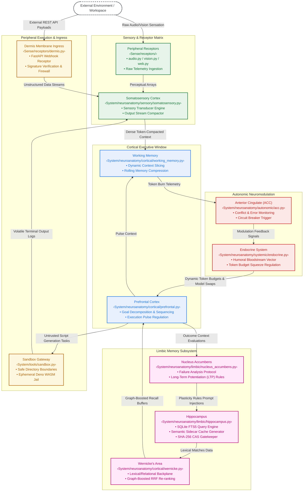

# 🧠 Own Your Brain: An Open-Source, Biomimetic AI Control Plane Inspired by the Unix Philosophy <3

  
 


**DISCLAIMER: For engineers reading this, I realized too late I took the biomimicry domain driven design too far. Please forgive me - directory and file names will change soon.**

>🪄 *TLDR: Run `bash setup.sh` (or `.\setup.ps1`) to launch the Thalamic Setup Wizard. Once configured, simply type `brain` from anywhere on your machine! 🪄*

> *Personal Statement*: My motivation for Brain is to create and share a system to help us better understand who we are, organize our lives, discover what we are capable of, and to build a community to change what's happening to our world *by working together*. I invite you to Brain with me. Please be kind as I'm just an idiot Product PM who loves computers and the human spirit.
>
> - Daniel Casper, 5/20/2026


## 🚀 Quick Start

Brain features a progressive enhancement architecture. The core installation takes less than 5 seconds.

1. Clone the repository and navigate inside.
2. Run the instant bootloader: `bash setup.sh` (Mac/Linux) or `.\setup.ps1` (Windows).
3. Complete the biomimetic Setup Wizard (TUI) to safely opt-in to autonomous features and sensory organs.
4. Restart your terminal to load the global alias.
5. Type `brain` from any directory on your computer to wake the system.

### 🛡️ Safe-by-Default (Advisory Mode)
For your absolute physical protection, Brain OS implements a strict **fail-closed, opt-in security model** for code execution. Out of the box, the system runs in a secure, read-only **Advisory Mode**:
* **Cognitive Tool Pruning:** Execution tools are completely stripped from agent payloads before reasoning begins, preventing infinite loops and token drain.
* **Semantic Alignment:** Agents are structurally informed via their system prompts to act solely as expert advisers, writing clean scripts to disk and providing step-by-step manual execution instructions.

To unlock full autonomous micro-sandbox container execution, explicitly opt-in by adding the following variable to your `.env` configuration - `BRAIN_ENABLE_CODE_EXECUTION=true`.

---


## 🔒 100% Local Privacy Guarantee
**Brain operates entirely locally by default.** - 🛑 **No cloud telemetry.** - 🛑 **No remote logging.**
- 🛑 **No shadow-syncing.**

All token tracking, memory ledgers, diagnostic vitals, and vector indexing happen directly on your local file system (`/logs` and `/System/neuroanatomy`). The *only* time data leaves your machine is when a specific context window is routed to your configured LLM provider (OpenAI, Anthropic, etc.).

If you configure Brain to use local SLMs (via Ollama), the entire OS can operate completely air-gapped.


---

## More than A Second Brain

Forget a "second brain." It's time you got an *biomimetic brain.* This Brain let's you:

1. **Think:** Fill Brain with your writing, code, videos, music, art, photos, and files (see `absorb` command). Brain understands all forms of multimedia, code, and most file formats.
	1. Brain uses **Obsidian** and a collection of MCP servers for the view layer.
	2. **Memory** - Brain's [five-tier memory approach](docs/Memory.md) (working memory, short term memory, relational epistemic memory, episodic memory, and memory consolidation) is one of its superpowers.
		1. When combined with Brain's [Anterior Cingulate Cortex](https://en.wikipedia.org/wiki/Anterior_cingulate_cortex) analog, Brain cleans and compacts memories, making them consistent with respect to semantics, time, and conceptual relation.

2. **Act:** Issue tasks to Brain directly from the CLI (`task`) or Obsidian (`crtl + shift + b` to queue for HITL inspection and `crtl + shift + enter` to execute). Brain can synthesize knowledge, write code, surf the web, transcribe text, speak, understand sound and images/video, and use peripheral devices (see the [Task Positive Network](https://en.wikipedia.org/wiki/Dorsal_attention_network) in human neurology).
	1. When acting on itself, Brain uses a hybrid approach - non-coding tasks are sandboxed in the host OS while coding tasks are jailed in a microvm / app container. See (`System/tools`).
	2. When acting on the outside world, Brain uses the `Sense` submodule as a secure and token-efficient transducer through a spinal HAL (microphones, webcams, HTTP / webhooks, sockets, etc.)
	3. *Three-Layered HITL* - pre-flight approval, running anything potentially dangerous (like npm install), and retry approval.
	4. *Deterministic JSON Architecture* - Brain evaluates complex goals using mathematically enforced, self-healing Pydantic JSON schemas, entirely eliminating regex hallucinations.

3. **Imitate:** Record, analyze, and flawlessly emulate human keyboard styling layouts and terminal tracks at zero token cost (see `observe`, `sync-mirror`, and `imitate` commands).
	1. *Stylistic Mirroring*: Uses a standard library tokenize compiler and multi-tier markdown micro-AST block classifier to track your precise formatting preferences (indentation, function casing, blockquotes, bold/italics tags, and checklists) without code leaks.
	2. *Allostatic Protection*: Restrains style drift using an exponential moving average frequency decay loop, while an in-memory Synaptic Hash Cache enforces rapid, bounded execution paths.

4. **Forage and Dream:** Brain attempts to understand **you and fulfill your goals autonomously,** whether hypothesizing, prototyping, exploring the world around it, or cleaning bad files and code (see `live`, `smell`, `daydream` and `forage` commands). Brain performs the software analog of the [Default Mode Network](https://en.wikipedia.org/wiki/Default_mode_network) in human neurology.
	1. *Author's Note*: Since my Brain is full of thoughts on building Brain, it daydreams about improving itself. See commits [ed09fbd](https://github.com/mrdanielcasper/brain/commit/ed09fbd414be8db44c346d73c7f2c168ba093d45) and [ed34e32](https://github.com/mrdanielcasper/brain/commit/ed34e327f92f90286b3a7ac8bdeb00ec9cd093e6) for examples.
	2. *Experimental Feature*: When Brain determines changes to its source code, it will create a neuroplasticity file for your review (see `evolve` command).
	3. *Roadmap item*: I view daydreaming as Brain's most important feature and will be continuously expanded to perform higher cognitive functions, like looking for work, studying your (local) market for opportunities, assisting you in creating art, or deepening your relationships with the people that matter. This will be done through declarative configurations.

5. **Connect:** Full interoperability with other Brains (as well as Hermes, OpenClaw, and OpenHuman, etc. thanks to the Unix philosophy) through ACP/MCP. Share knowledge, memories, and code `engrams` with other Brains and your AI ecosystem.
	1. *Author's Note*: Highly experimental. We are in pre-alpha, fellows :)
	2. *Author's Note:* Brain's first user (other than me) was actually my friend's AI, which learned from Brain how to improve crawling the web.
	3. *Roadmap item*: I plan to create a gift economy between Brains, *obviously* called Hivemind.

All this with:
- No databases (excluding an ephemeral Python native SQLite DB for memory performance).
- No dependencies other than the Python ecosystem and microvms (hopefully).
- As much [token economics](./docs/Token-Economics.md) as I can think of (zero cost runs, semantic compression, memory windows, tool truncation, backoffs, budgets, RAG, local LLM support, dynamic LLM selection, parent process monitoring).
- **Flat files like its the 1970s where the LLM *sees all and knows all*.**
	- Including its own source. Brain can work on Brain if you let it (totally unsafe; have fun).
	- Easy to innovate when we don't worry about scaling to infinity and beyond.


>*P.S. - I built this by collaborating and arguing with Gemini staring on 4/20, building one module at a time, refining it, paying off tech debt, and adding test coverage. Claude and ChatGPT acted as our reviewers and critics. No vibe coding here. Brain **will** have cognitive biases, conceptual drift (just look at the directory/filenames/code, mae culpa), and misbehaving features (LLMs are indeterministic after all). Please be patient with us as we get past pre-alpha.*

---

## 🗺️ System Topology & Cognitive Flow Architecture

The system operates as a decoupled, biomimetic control loop. Environmental exoreceptor signals and webhooks pass through the Sensory Layer to undergo token compaction before entering the Cortical executive attention window, guarded continuously by autonomic neuromodulation feedback and limbic memory indexing.



---
## 🌟 Brain's Core Philosophy

Most AI frameworks let the AI run wild in a container without any regard for context, token economics, security, or protection of the data in that container. So, you get weird behavior, bad outputs, API bills, and your API keys stolen because of a 🪱. Oh, and chock full of YAGNI features, poisoned supply chains, with a global state tucked away in databases (making that global state invisible to the all-seeing AI).

**Brain operates on the contrarian hot-take that we should go back to the 1970s where everything is a file and we try to make the runtime safe and economic (only using ephemeral microvms when we code).** And rather than just build another "AI OS," we can get architectural robustness simply by copying biology. Brain treats itself as a living, self-maintaining organism. Our principles:

1. **Own Your Brain:** Put yourself in Brain. Use any LLM. Change it however you like. Brain is yours.
2. **Unix Philosophy** - Everything is a file, composable, and does one thing well. Thank you, Ken Thompson and Dennis Ritchie.
3. **Biomimicry** - Why reinvent what biology has already optimized? We unlock *hidden potential at speed* by copying the human mind with the Unix Philosophy.
	1. For a full list of the 1:1 biological mapping, see [Biomimesis](./docs/Biomimesis.md)
4. **Zero-Waste Token Economics** - All development actively and aggressively tries to zero out your token costs, including using determinism, local LLMs, and every token optimization technique I can offer (such as executing 90% similar commands without LLM inspection, or saving repeated code-actions). This includes algorithmic line deduplication pre-passes, canonical context formatting, and deterministic message payload pre-slicing to bypass expensive LLM API calls seamlessly.
	1. Preferred order: Determinism > Local LLMs (for lower cognitive tasks) > LLMs
	2. Enteric System and Cerebellum - repeat commands use 0 cost token evaluation. Procedural code is saved and rerun at 0 cost with [engrams](https://en.wikipedia.org/wiki/Engram_(neuropsychology)), just like muscle memory in the [cerebellum](https://en.wikipedia.org/wiki/Cerebellum).
5. **Shift-Left:** Shift left all the things! Security, testability, usability, token economics, performance, readability, quality, and all other "-ities". No vibe coding or slop here - we argue with the AI about every module and feature until its fit for humans.
	1. **Security** - Brain takes a hybrid and defense-in-depth approach to security. Coding tasks are sandboxed in microvms (Level 1) while non-coding tasks run directly on the host machine (level 0). Secrets are vaulted and actively scanned for in runtime and files. Watchdog kills Brain if it misbehaves like it has [apoptosis](https://en.wikipedia.org/wiki/Apoptosis).
6. **Be Kind To Your Self And Your Community** - Individuals survive through self-care, and our species survives by collaborating. Let's work together to help each other.

---
### 👁️ Supercharge Your Obsidian Vault (The Visual Cortex & Somatosensory Layer)

Go beyond passive second brain Obsidian. This Brain elevates your Vault into an active **[Visual Cortex](https://en.wikipedia.org/wiki/Visual_cortex) and [Somatosensory Layer](https://en.wikipedia.org/wiki/Primary_somatosensory_cortex)**—providing a real-time, human-and-machine readable window directly into your whole life (`Meta`, `Studio`, `Personal`, `Professional`, `Media` domains). By banishing databases to the shadow realm, this flat-file architecture creates a self-improving loop where humans and autonomous multi-agent swarms safely collaborate using hybrid XML-Markdown file contracts, step-gated human-in-the-loop verification boundaries, and other Brains (experimental).
#### 🔬 How Brain Supercharges Your Vault

Backed by the background daemons, Brain optimizes your Vault performance and keeps your notes pristine at near-zero token cost:

- **The Reward Gate ([Nucleus Accumbens](https://en.wikipedia.org/wiki/Nucleus_accumbens)):** Step-gates autonomous swarm tool execution paths inside strict validation blocks until you release inhibition via an explicit manual approval flag in `Meta/Pending_Actions.md`.

- **Static Analysis Profiling ([Olfactory Bulb](https://en.wikipedia.org/wiki/Olfactory_bulb)):** Runs fast, localized regex and linting checks at **$0.00 in API tokens** to flag broken document formatting, empty placeholders, dead `[[wikilinks]]`, and code smells (get it?) in `Meta/Olfactory_Anomalies.md`.

- **The Mirroring Array ([Premotor Cortex](https://en.wikipedia.org/wiki/Premotor_cortex)):** Involuntary standard library and block micro-AST trackers record terminal loops and prose habits natively behind thread-safe file replacements to insulate your workspace from manual profile switching overhead.

- **The Graph Backplane ([Anterior Cingulate Cortex](https://en.wikipedia.org/wiki/Anterior_cingulate_cortex)):** Maps explicit cross-note relationships using custom-compiled string matching, strictly protected by an ACC circuit breaker that blocks serialization of `.brain/graph_state.json` if agent looping faults occur.

- **Working Memory Buffer ([Prefrontal Cortex](https://en.wikipedia.org/wiki/Prefrontal_cortex)):** Eliminates API context limits via **Rolling Context Compression**. Before routing to AI, it uses zero-cost canonical context formatting to strip redundant whitespaces, algorithmic line deduplication to drop repetitive logs, and deterministic payload slicing for messages over 4,000 characters. If the 12k character threshold is still breached, it spawns recursive fast-model summaries, injecting a synthesized "Working Memory" payload directly into the prompt stream without corrupting sequence roles.

- **Semantic Belief Injection ([Hippocampus](https://en.wikipedia.org/wiki/Hippocampus)):** Passively runs during background sleep cycles to read interaction logs, extracting and serializing persistent architectural and user preferences into `Core_Beliefs.md` for zero-shot personalization upon the next boot.

- **Vectorless Search ([Wernicke's Area](https://en.wikipedia.org/wiki/Wernicke%27s_area)):** Replaces heavy embedding search lookups with localized SQLite FTS5 keyword lookups (`hippocampus.db`), dynamically re-ranking hits using knowledge graph connection density to inject precise snippets instead of entire files.

- **Quarentine and Cleanup ([Lysosome](https://en.wikipedia.org/wiki/Lysosome)):** Intercepts agent file-deletion calls, safely moving assets into a tracking cell in the `.trash/` directory bound to a historical `manifest.jsonl` ledger for effortless recovery.

### ⚡ Synaptic Setup & Zero-Alt-Tab Workflows

1. **Import the Vault:** Open Obsidian, choose **"Open folder as vault"**, and target the absolute root folder of your cloned Brain OS repository. Initialize directories by running `uv run System/cli.py setup` in your shell.

2. **Innervate the Filesystem:** Run the somatosensory background daemon to automatically trigger zero-cost linting adjustments, AST updates, and local file styling formatters every time you hit save (`Ctrl + S`) inside your notes (`./brain watch`).

3. **Command the Swarm Natively:** Leverage the community **Shell Commands** plugin pre-configured within the repository layout to dispatch and approve pipelines natively without leaving your editor:

    - **Queue Task (`Ctrl + Shift + B`):** `uv run System/cli.py task "{{_task}}" --obsidian` — Safely writes parameters into an execution queue and logs detailed pipeline diagnostics inside `Pending_Actions.md`.

    - **Approve Task (`Ctrl + Shift + Enter`):** `uv run System/cli.py approve` — Releases the subcortical execution lock, firing the active task backlog across parallel swarm channels.

---
## 👁️ Sense (Sensory Nervous System)

Most agentic frameworks communicate with the external world using raw web scrapers or unmanaged directory dumps, breaking layout context and wasting tokens. Brain solves for this using **`Sense`**— a completely decoupled, transducer modeled directly on biological sensory organs.

In biology, the brain does not process raw photons; the [retina transduces them into electrical action potentials](https://en.wikipedia.org/wiki/Visual_system). Following this principle, `Sense` intercepts chaotic environmental stimuli (unstructured HTML layouts, media feeds, audio streams, network sockets), strips away noise, and compresses payloads into low-entropy representations ready for cortical attention layers.

### 🔬 How Brain Innervates the Peripheral Boundary

Operating as a standalone package, `Sense` isolates raw environmental intake using explicit hardware receptors and mathematical perimeters:

- **Deterministic Sensory Transducer (Inspired by [TokenJuice](https://github.com/vincentkoc/tokenjuice) Engine):** A pure-Python deterministic sensory engine natively compacts execution traces at $0 cost before they reach cognitive layers. Pre-compiled regex matrices instantly strip ANSI color codes, transient progress spinners, and auxiliary package manager noise (e.g., `pip`, `yarn`, `bun` boilerplate), protecting context windows from verbose terminal slop.

- **Web Transduction & SSRF Firewall ([Echolocation](https://en.wikipedia.org/wiki/Human_echolocation)):** Passes input URLs through a strict Shift-Left firewall inside `receptors/web.py`. The validator resolves hostnames ahead of time, dropping transactions instantly if a destination maps to a loopback adapter (`localhost`), `0.0.0.0`, or private subnets. Validated text layers are parsed to strip layout nodes (`script`, `nav`, `footer`) and capped at a rigid `MAX_SENSORY_CHARS = 25000` gate to prevent token bloat.

- **Visual & Frame Extraction ([Retina](https://en.wikipedia.org/wiki/Retina)):** Manages multimodal vision streams inside `receptors/vision.py`. Instead of feeding raw, high-overhead video arrays to models, an interval loop samples up to 8 distinct keyframes from media tracks using OpenCV, translating the metrics into low-overhead base64 JPEG data strings.

- **Acoustic Tracks ([Ear](https://en.wikipedia.org/wiki/Ear) & [Mouth](https://en.wikipedia.org/wiki/Mouth)):** Links the host machine's physical microphone and speaker drivers inside `receptors/audio.py`. The recording module captures audio hardware targets at a clean 44.1kHz sample rate, automatically saving paths within a media quarantine boundary to enforce environment isolation.

- **File Format Support ([Gustatory Profiling](https://en.wikipedia.org/wiki/Taste)):** Cross-sections heavy data layouts (multi-page PDFs, database records, large server logs) via `tools/sensory.py`. It samples files by mapping structural blueprints and head/tail dimensions, allowing agents to read large documents efficiently without causing context degradation.

* **Webhook Ingress (https://en.wikipedia.org/wiki/Dermis):** Spawns a hardened FastAPI web server layer via `Sense/receptors/dermis.py` to listen for and transduce incoming external webhook signals. The gateway safely parses incoming reverse tunnel proxies (`X-Forwarded-For`, `X-Real-IP`) to isolate authentic client coordinates before executing a sequential multi-layered security validation chain:
    1. *Allostatic Load Control:* Temporally throttles burst incoming traffic spikes, enforcing a strict rate limit window capped at 50 requests per rolling 60 seconds per client IP.
    2. *Anti-OOM Stream Isolation:* Blocks memory-exhaustion payloads immediately if request dimensions exceed a rigid 2MB safe ceiling, processing incoming payload data asynchronously in safe chunks to eliminate memory parsing locks.
    3. *Cryptographic Verification Chain:* Verifies data packet validity against environmental keys using native HMAC-SHA256 check structures.
    4. *Sliding Replay Mitigation:* Utilizes a sliding 1,000-item signature FIFO queue to intercept duplicate traffic frames, preventing malicious message reflection attacks.

    Once authenticated, unstructured payload JSON objects are automatically parsed according to declarative layout instructions mapped in `webhooks.yaml`, translated into pure intents, logged to a rotating observer file (`Sense/logs/dermis.log`), and transduced cleanly up the main nervous spinal cord (`transduce_to_spine`) to activate internal cognitive attention loops.

- **ExoReceptor ([Exocortex](https://en.wikipedia.org/wiki/Brain%E2%80%93computer_interface)):** Spawns an asynchronous background listener inside `receptors/exoreceptor.py` tracking dual-protocol loops (REST webhooks on port `8765` and TCP sockets on port `8766`). Connections are protected by a token-bucket `SynapticRateLimiter` that models synaptic fatigue, dropping burst traffic spikes immediately to protect parser loops from DDoS exploitation.

### 🕹️ Direct Peripheral Triggers: Zero-Token Hardware Testing

Because the peripheral sensory network is completely decoupled from core reasoning layers, developers can manually test, drive, or pipe hardware functions from the terminal at **$0.00 in AI token costs**.

| **Peripheral Receptor Target** | **CLI Execution Track** | **Biological Analogue & Operational Impact** |
| ------------------------------ | -------------------------------------------------------------------------------------- | ---------------------------------------------------------------------------------------------------------------------------------------------------------------------------- |
| **Headless Layout Capture** | `uv run Sense/cli.py screenshot "https://news.ycombinator.com" "workspace_latest.png"` | **The Visual Cortex / Screen Auditing:** Launches a headless browser session via Playwright to capture a full-page image snapshot for layout verification.                   |
| **Web Sensory Transduction** | `uv run Sense/cli.py scrape "https://github.com" > codebase_stimulus.md`               | **The Retina / Markdown Scraper:** Fetches external web stimuli, strips display presentation nodes, and transforms raw HTML into pure markdown.                              |
| **Acoustic Audio Ingestion** | `uv run Sense/cli.py listen --duration 5 --output local_reflex.wav`                    | **The Physical Ear / Hardware Mic:** Accesses the host's microphone drivers at a clean 44.1kHz sample rate to capture ambient sound files inside media isolation boundaries. |
| **Vocalization Presenter** | `uv run Sense/cli.py speak local_reflex.wav`                                           | **The Physical Mouth / Speaker Output:** Streams raw audio wave entries directly out to the host machine's hardware speakers, bypassing cognitive loops.                     |
| **Zero-Token Static Auditing** | `uv run Sense/cli.py smell "Studio"`                                                   | **The Olfactory Bulb / Rot Detection:** Processes high-speed string matching to find broken note anchors, placeholder headers, and dead `[[wikilinks]]`.                     |
| **Footprint-Safe Sampling** | `uv run Sense/cli.py taste "System/logs/medulla.log"`                                  | **The Gustatory System / Taste Profiling:** Inspects dense logs, multi-page PDFs, or huge CSV rows by cross-sectioning layout blueprints to safeguard context windows.       |

## 💻 Using Brain: Commands & Customization

Brain works as a CLI tool, an in-app Obsidian task queueing and execution pipeline, and a background daemon.

Customizing Brain's LLMs, routes, agent definitions, tools, webhooks, and daemon settings is done through declaratively yaml files under `./System/config`.

### 📊 Core Ecosystem Command Matrix

Here are the important CLI tools:

| **Command Invocation Track** | **Target Subsystem File** | **Neuroanatomical Layer** | **Operational Impact & Safety Strategy** |
| :--- | :--- | :--- | :--- |
| **`./brain`** | `System/core/onboarding.py` | **Synaptic Genesis Onboarding** | Automatically bootstraps local env and directories. |
| **`./brain live`** | `System/neuroanatomy/systemic/thymus.py` | **Thymus Watchdog Supervision** | Spawns the out-of-process parent watchdog to monitor Brain's child runtime process over a named channel. Instantly executes a `SIGKILL` if code loops or out-of-bounds file traversals occur. |
| **`./brain absorb [PATH] [--domain TEXT] [--tags TEXT]`** | `System/cli_cognitive.py` | **Parietal Lobe Ingestion** | Ingests directories, scripts, or markdown notes cleanly into Brain's knowledge network. |
| **`./brain task "[DESCRIPTION]" [--domain TEXT] [--route TEXT] [--obsidian]`** | `System/core/orchestrator.py` | **Prefrontal Cortex Governance** | Dispatches goal definitions across parallel swarm threads. If `--obsidian` is active, it enforces an offline safety audit and queues the task inside `Pending_Actions.md` awaiting manual confirmation. |
| **`./brain daydream`** | `System/neuroanatomy/autonomic/dmn.py` | **Default Mode Network** | Activates a low-priority background thread during idle cycles to prototype modifications, review logs, form hypotheses, and find non-obvious code links. |
| **`./brain evolve`** | `System/cli_cognitive.py` | **Neuroplastic Synaptic Rewiring** | Backs up configs (`agents.yaml.bak`) and processes md file updates to reprogram its configs (with HITL). |
| **`./brain sleep`** | `System/neuroanatomy/autonomic/medulla.py` | **Circadian Rest Phase** | Performs log rotations, triggers skill compilation, extracts core semantic beliefs, and compacts SQLite FTS5 database indices to eliminate tracking bloat. |
| **`./brain forage "[TOPIC]" [--domain TEXT]`** | `System/cli_cognitive.py` | **The Forager Drive** | Drops the pipeline execution loop into a headless sandbox state to scrap external web search loops and extract target fact maps. |
| **`./brain observe [AGENT] [OBJ] [STEPS]`** | `System/cli_somatic.py` | **Mirror Neuron Tracking** | Directs the mirror neurons to record a successful multi-step tool execution path. |
| **`./brain sync-mirror "[PROMPT]"`** | `System/cli_somatic.py` | **Hebbian Plasticity Recall** | Replicates previously captured cross-agent tool trajectories instantly for 0 cloud inference tokens. |
| **`./brain imitate [PATH] [--mode TEXT]`** | `System/cli_somatic.py` | **Synaptic Profiling Pass** | Manually fingerprints plain-text coding layouts or markdown notes into the allostatic moving memory ledger. |
| **`./brain status`** | `System/tools/topology.py` | **Interoceptive Diagnostics** | Displays live internal performance indicators, including current daily token burn, background PIDs, and calorie limits. |
| **`./brain compile`** | `System/neuroanatomy/autonomic/cerebellum.py` | **Cerebellar Skill Encoding** | Scans completed episodic logs to extract verified workflow executions, compiling complex setups into zero-token muscle memory shell scripts. |
| **`./brain reflex [ENGRAM_NAME]`** | `System/cli_somatic.py` | **Somatosensory Involuntary Reflex** | Runs an immediate ahead-of-time Abstract Syntax Tree (AST) sweep to block toxic module links before running a script engram within a secure sandbox process. |

### ⚙️ Declarative Customization: Tuning the Cognitive Matrix

Agents, routing, tooling, everything is managed declaratively in YAML in `System/config/`.

* **Swap Models Instantly:** Brain OS runs on top of LiteLLM, natively supporting 100+ cloud and local LLM options. Point model aliases to local Ollama weights, OpenAI, Anthropic, or OpenRouter instantly inside `models.yaml`.
* **Edit Personas & Prompts:** Redefine structural workflows, error handling profiles, or system instructions for any sub-agent in pure plaintext inside `agents.yaml`.
* **Gated File Sandbox Scopes:** Restrict folder permissions and file-system read/write access down to specific workspace directories (least-privilege model) using the granular arrays inside `routes.yaml`.

---

#### 📊 Configuration Profile Matrix

| Configuration Profile | Core Target File Path | Neuroanatomical Layer & System Impact |
| :--- | :--- | :--- |
| **Personas & Code Rules** | `System/config/agents.yaml` | **The Neocortex**: Manages explicit sub-agent guidelines, validation protocols, and execution milestones. |
| **Endpoint DNA** | `System/config/models.yaml` | **The Hemispheres**: Connects processing tracks to specific provider models, supporting global auto-discovery defaults. |
| **Pipeline Routing** | `System/config/routes.yaml` | **The Synaptic Pathways**: Maps tool access combinations and sandbox boundaries to clear execution types. |
| **Vitals & Rhythms** | `System/config/medulla.yaml` | **The Brainstem**: Calibrates active daemon lifecycles, network ports, folder watch fields, and token limits. |
| **Tension Management**| `System/config/acc.yaml` | **The Anterior Cingulate**: Governs failure tolerances, triggering deterministic low-temperature model swaps to clear loops. |
| **Signal Translation**| `System/config/webhooks.yaml` | **The Dermis Membrane**: Translates unstructured incoming external webhooks into parsed data templates. |

---

> ⚡ **Zero-Debt Verification:** To guarantee profile changes remain safe, verify your edits against our automated test and linting gates ahead of committing additions:
> ```bash
> uv run pre-commit run --all-files
> uv run pytest --cov -n 0
> ```

Test acceleration:

- For Mac:

```bash
export OMP_NUM_THREADS=1
export MKL_NUM_THREADS=1
export OPENBLAS_NUM_THREADS=1
export VECLIB_MAXIMUM_THREADS=1
export NUMEXPR_NUM_THREADS=1
```

- For Windows:

```powershell
$env:OMP_NUM_THREADS=1
$env:MKL_NUM_THREADS=1
$env:OPENBLAS_NUM_THREADS=1
$env:VECLIB_MAXIMUM_THREADS=1
$env:NUMEXPR_NUM_THREADS=1
```

---
## 🤝 Contributing

Shape the future of Brain - contributions are welcome! Because Brain values Shift-Left engineering, **we enforce strict 100% test coverage on all security and execution bypass logic.**

Take a look at our [contributing guidelines](./CONTRIBUTING.md) and our [code of conduct](./CODE_OF_CONDUCT.MD).

---
*Brain — Designed for humans to collaborate with each other and AI.*
