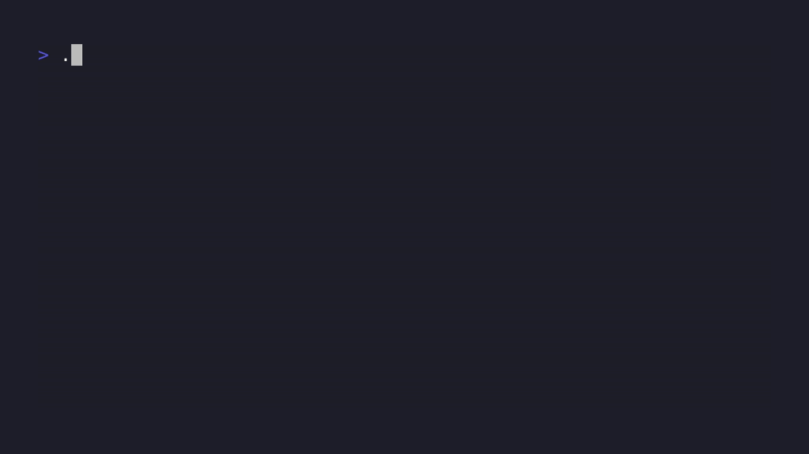

# 🧠 CoreTex: UNIX Inspired Biomimetic Agentic Control Plane and Knowledge Engine

       [](https://discord.gg/7x9BpVv3)

> **Note to Systems Engineers:** I took the biomimicry domain-driven design quite far (e.g., the master daemon is the `Medulla`, short-term memory is the `Hippocampus`). It is eccentric, but underneath is (arguably) a highly optimized, concurrent, lock-safe, and execution engine that runs purely on flat files.

**CoreTex** is a UNIX-inspired, biomimetic agent harness and knowledge engine intended to help you use AI safely, cost-effectively, and in a way that helps you integrate the whole of your life.

Borrowing deeply from [human neuroanatomy](docs/Biomimesis.md), CoreTex lets you organize and synthesize information (supercharging Obsidian Vaults), write and execute code in a hardened environment, and utilize peripherals (camera, mic, etc.) alongside webhooks and headless web browsing to observe and react to the outside world.

CoreTex is also intended to be an always-on daemon, understanding your goals and helping you achieve them over time.



---

### 🏗️ Architectural Highlights & What Makes It Different

1. **UNIX Philosophy:** Everything is a file like it's the 1970s! State, IPC, data, and queue files are guarded by OS-level locks. Databases are banished to the shadow realm (excluding the SQLite FTS5 DB which reads the flat files for performance). Composability with standard operators is supported - pipe, redirect, etc.
2. **Cerebellar Muscle Memory (Zero-Token Execution):** When CoreTex successfully completes writing code, e.g. setting up a project, the Cerebellum can make it an engram to rerun at 0-cost. _Highly experimental_ and will need improvements. [Roadmap item](ROADMAP.md) to enable engram sharing. [Token economics](docs/Token-Economics.md) is a major concern for CoreTex.
3. **5-Tier Biomimetic [Memory Stack](docs/Memory.md):**
    * **Working Memory** - token aware compression inserted between active head and tail for infinite task continuity without amnesia.
    * **Short-Term Recall (Vectorless Search):** Replace the DB with a local SQLite FTS5 index and BM25 ranking. Snippet truncation finds code matches without bloating the context window.
    * **Relation Knowledge** - maps dependencies and markdown connections to a serialized graph, protected by the Anterior Cingulate Cortex circuit breaker if a loop is detected.
    * **Episodic Memory** - keeps a ledger of its objectives and actions in a thread safe WAL JSONL stream.
    * **Long Term Memory** - when CoreTex sleeps, it rotates logs and extracts key memories from them which are used to align the system to you
4. **Safe-by-Default:** The default "Cognitive Mode" is strictly for reading/writing/working on an Obsidian vault or files. Code execution requires explicit user opt-in and is isolated inside an offline Deno-hosted V8 + WebAssembly jail with strict resource limits.

---

## ⚡ Example Usage

CoreTex operates on text files and local indexing, meaning you can parse your entire codebase before spending a single API token.

**1. Absorb data (0 Token Cost - Local SQLite Indexing)**
```bash
./ctx absorb ./my_old_project -d Studio/MyProject -t "legacy, python"
./ctx absorb ./journal -d Personal/Journal -t "journal, writing"
```
**2. Execute a sandboxed agentic task**
```bash
./ctx task "Audit ./my_project for concurrency race conditions and output to audit.md"
```
**3. Native Unix Piping**
```bash
cat error.log | grep "Timeout" | ./ctx task "Explain this failure cascade"
```
**4. Daydreaming**
```bash
./ctx daydream
# NOTE: CURRENTLY ONLY DAYDREAMS ABOUT ITSELF, SELFISH MACHINE.
# TOPIC-BASED DREAMING IS AN IMMEDIATE TO-DO
```

---

## 🚀 Installation

CoreTex features a unified setup script to automatically handle prerequisites, virtual environments, and container architectures.

### 🍏 macOS & 🐧 Linux
```bash
chmod +x setup.sh
./setup.sh --check      # Optional: run preflight diagnostics
./setup.sh              # Interactive setup (use --local or --docker to bypass prompts)
```

### 🔷 Windows (PowerShell)
```powershell
powershell -ExecutionPolicy Bypass -File .\setup.ps1 -Check
powershell -ExecutionPolicy Bypass -File .\setup.ps1  # Use -Local or -Docker to bypass prompts
```

*Note: CoreTex natively supports routing via Enterprise API Gateways (Cloudflare, Portkey, Helicone) for observability. Select `[Gateway]` during setup.*

---

### 🪐 Deployment & Initialization ("Synaptic Genesis")

The setup utility offers two distinct runtime architectures:
1. **Local (Recommended):** Uses Astral's hyper-fast `uv` and the `deno` secure runtime.
2. **Isolated Container:** Uses Docker Compose with strict UID/GID mapping to prevent root-owned file pollution.

Both paths launch the **Synaptic Genesis** wizard to configure your nervous system:
* **Operating Profile:** *Cognitive Mode* (safe advisory) or *Agentic Mode* (sandboxed execution).
* **Sensory Innervation:** Toggle vision scrapers (Playwright) or local hardware mic/speakers.
* **Synapses & Workspace:** Link your LLMs (OpenAI, Anthropic, local Ollama) and bind CoreTex to a target directory.

Once complete, restart your terminal and command the swarm:
```bash
./ctx status
./ctx task "Summarize this repository in five bullets"
```

### First Use

```bash
./ctx status # health check
./ctx live # engage main daemon
./ctx task "do a thing" # executes along route + domain
./ctx absorb examples/show-hn-mini-project --domain Professional --tags show-hn,demo
./ctx daydream
```

---

## 🔐 [Security](docs/Security.md) & Sandboxing (Safe-by-Default)

Running LLM-generated code locally is inherently dangerous. CoreTex ships in **Cognitive Mode** by default—it can write code and plan tasks, but it *cannot* execute scripts. If you explicitly opt-in (`CORETEX_ENABLE_CODE_EXECUTION=true` in your `.env`), CoreTex activates a strict containment matrix:

1. **The Deno + WASM Jail:** CoreTex does *not* run generated code in your native Python or Bash environment. It forces the LLM to write code executed inside an ephemeral, unprivileged **Deno + WebAssembly** instance.
    1. Firecracker support is on the horizon
2. **The Volume Mask:** The agent is physically incapable of seeing files outside the specific directory bound during setup.
3. **Cognitive Fallback:** If Deno is missing or unreachable, the system safely degrades back to *Cognitive Mode*, immediately stripping the agent's subprocess execution tools entirely.

---

## 📁 Optional Obsidian Integration

**[Obsidian](docs/Obsidian.md)** is a first class citizen in CoreTex. CoreTex will automatically detect the `.obsidian` configuration folder and atomically configure native hotkeys (`Ctrl+Alt+S`).
*Note: To map active shell commands directly to these hotkey bindings from within the graphic editor interface, please ensure the standard `obsidian-shellcommands` community plugin is active in your vault. You may struggle with these.*

---

## ⌨️ Core Commands

[Commands](docs/Commands.md) include:

* `./ctx setup`: Boot the interactive onboarding wizard to configure API keys, LLM routing, and workspace bindings.
* `./ctx task "<prompt>"`: Dispatches a multi-agent swarm to accomplish a goal.
* `./ctx daydream`: Triggers the Default Mode Network (DMN) to autonomously organize files, compress old memories, and refactor code in the background.
* `./ctx status`: Opens the real-time Cortical Telemetry dashboard to monitor active agent loops and memory usage.

### Sensory Perception Subcommands (Sense)
Trigger CoreTex [external receptors](docs/Sense.md) directly from the execution plane:
* `./ctx sense screenshot "https://google.com" "google.png"` - *Takes a headless web screenshot.*
* `./ctx sense perceive "google.png" "Describe layout"` - *Uses the Occipital Lobe to analyze visual stimuli.*
* `./ctx sense scrape "https://github.com"` - *Transduces a web page into raw markdown text format.*
* `./ctx sense listen --duration 10` - *Activates physical microphone hardware receptors.*
* `./ctx sense speak output.wav` - *Dispatches sound arrays down physical speaker hardware channels.*

### 💀 Systemic Apoptosis (Zero-Residue Uninstall)
If you are done with CoreTex, leave no trace behind:
```bash
./ctx destroy
```
*This securely purges all local ledgers, token tracking logs, environment API keys, and execution queues. It respects your machine.*

---

## 🤝 Contributing
CoreTex values Shift-Left engineering. We enforce focused regression coverage around security, file locking, and execution bypass logic. To verify your PR against our automated gates:
```bash
uv run pytest System/tests Sense/tests -v
uv run ruff check .
```

---

## ⭐️ Star the Project

If you believe in a local, flat-file AI harness and want to see where this biological experiment goes, please consider giving the repo a star! It is the best way to help other developers discover the project which will help me keep it going.
